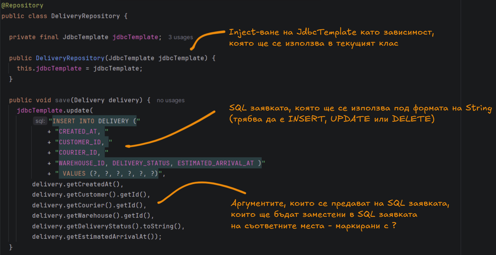
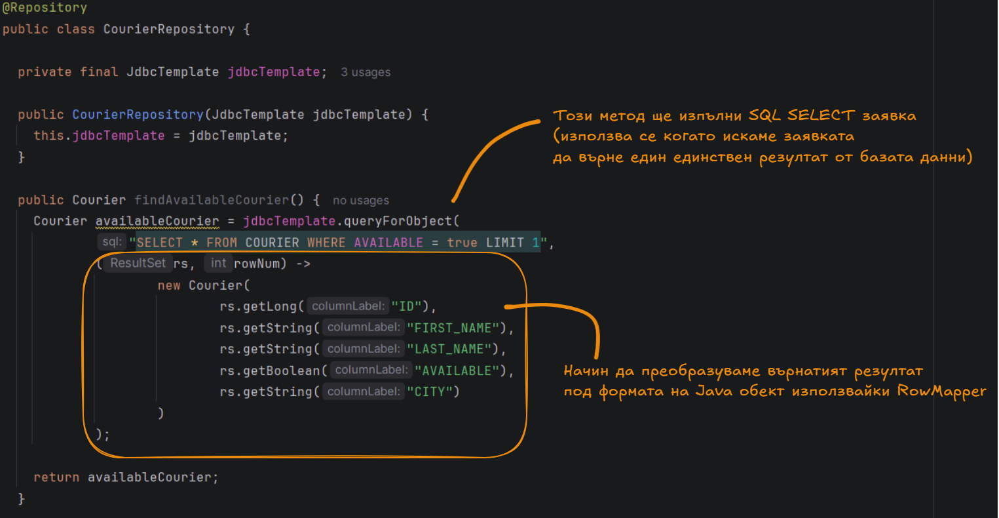
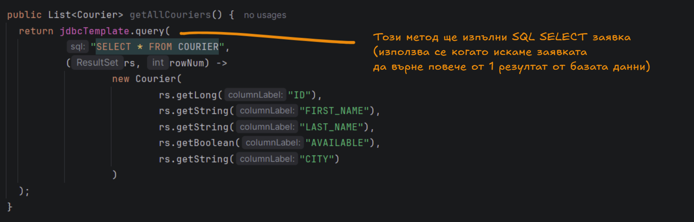
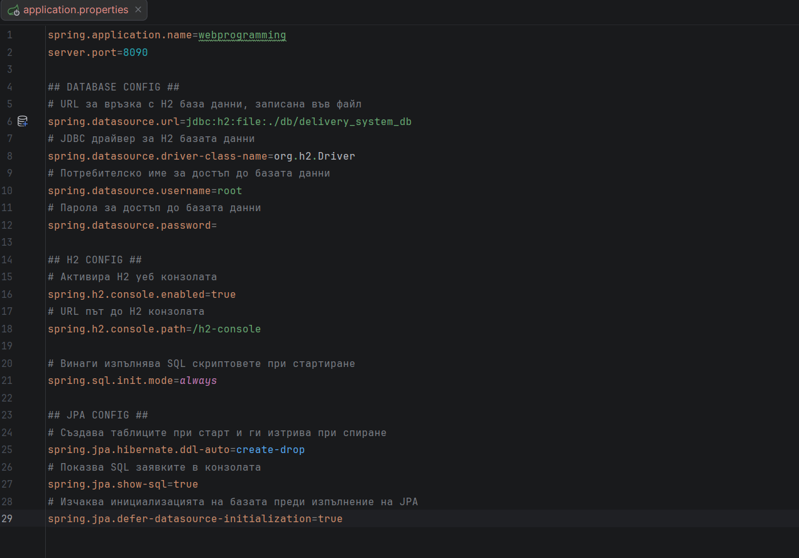
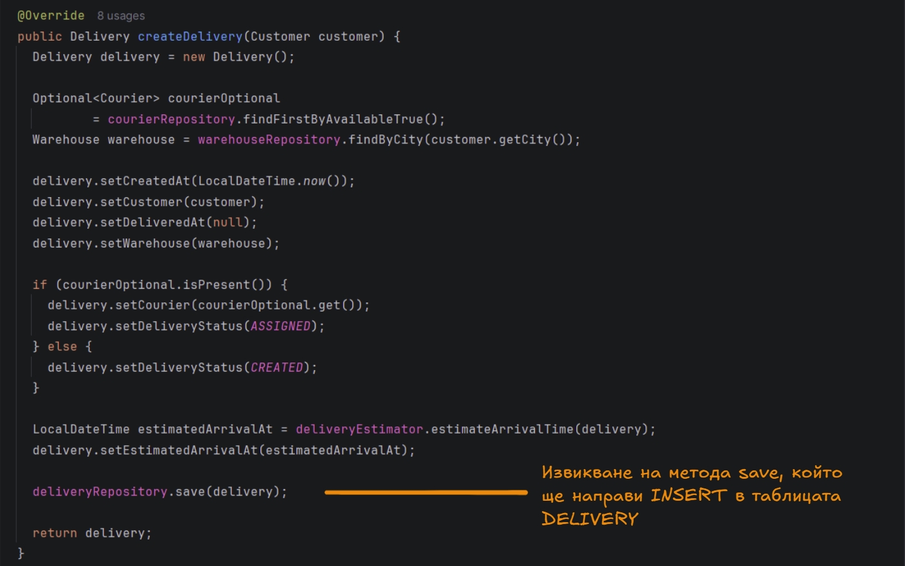
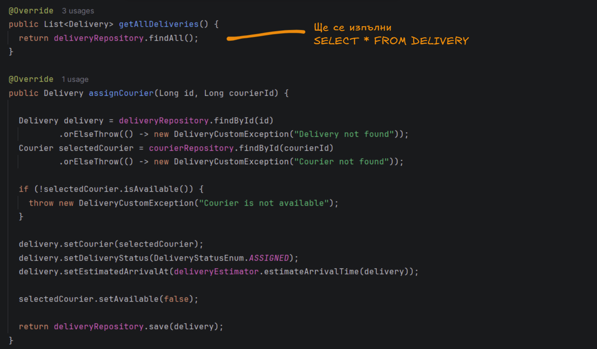

# ***Работа с база данни използвайки Spring JDBC и Spring Data***

## Въведение
В четвъртото занятие се фокусирахме върху работата с бази данни в контекста на Spring Boot приложения. 

Основните теми в това занятие включват:
- Работа със JdbcTemplate –  изпълнение и създаване на SQL заявки и работа с база данни чрез Spring JDBC.
- Работа със Spring Data JPA – създаване на интерфейси, разширяващи JpaRepository, и
използване на query методи за достъп до данни без нужда от писане на SQL заявки.
- Имплементиране на Repository Pattern, който абстрахира детайлите на достъпа до базата 
- Конфигуриране на връзка с база данни (H2) и използване на Spring Boot свойства за конфигурация.
- Генериране на SQL схеми чрез JPA анотации като @Entity, @Id, @GeneratedValue, @Column, @ManyToOne и др.

В този документ се обобщават основните концепции и практически насоки, свързани с:
- Работа с база данни чрез JdbcTemplate и Spring Data JPA
- Създаване и използване на Repository интерфейси
- Мапинг на Java обекти към базови таблици чрез JPA

## Съдържание
- [Работа с база данни в Spring](#db-spring)
- [Repository pattern](#repository-pattern)
- [Как да използваме Spring Data JPA ?](#spring-data)
- [Допълнителни материали](#resources)

<a id="db-spring"></a>
## I. Работа с база данни в Spring

От самото начало Spring се стреми да улесни достъпа до бази данни. 
В ранните версии (Spring 1.x) се използва предимно JDBC,
но с появата на ORM (Object-Relational Mapping) технологии
като Hibernate, Spring интегрира и тяхната поддръжка.


При работата с бази данни и съставянето/използването на SQL съществуват
различни школи или стилове, които обхващат различни подходи и парадигми.

### Основни школи:

#### 1. Raw SQL:

- Ръчно написан SQL (SELECT, INSERT и т.н.)
- използване на драйвер за комуникация с даден сървър за управление на бази данни
- Предимства:
    + голям контрол върху данните в базата
    + добра производителност
    + подходящо за сложни заявки или оптимизации
- Недостатъци:
    + голям контрол върху данните в базата
    + по-трудна поддръжка
    + много boilerplate

#### 2. ORM (Object-Relational Mapping):
- връзка м/у кода и базата данни (с анотации)
- автоматично генериране на SQL заявки
- User.java == USER table
- Предимства:
    + по-малко код
    + обектно-ориентиран стил
    + разкачване от базата данни
- Недостатъци:
    + може да е по-бавно при големи заявки
    + липса на пряка комуникация м/у дев и базата данни
    + "скрити" SQL заявки
    + може да е неефективно за сложни заявки

<a id="repository-pattern"></a>
## II. Repository pattern (Слой за достъп до данни)

Repository Pattern е архитектурен шаблон, който осигурява абстракция между бизнес логиката и базата данни. 
Той скрива детайлите на достъпа до базата данни зад интерфейс, така че бизнес логиката
(сервизните класове) не "знаят" как точно се извличат данните – те просто извикват методи от репозитория.

### 1. Какво е @Repository?

@Repository е специална Spring анотация, която указва, че даден клас е компонент
от слоя за достъп до данни и трябва да бъде управляван от Spring контейнера.

- Така Spring знае, че това е компонент, който работи с базата данни.
- Когато използваш JpaRepository, не е задължително ръчно да слагаш @Repository, защото Spring автоматично го обработва чрез @EnableJpaRepositories.

### 2. Начини за достъп до persistent ресурс

#### 2.1 Spring JDBC (JdbcTemplate):
JdbcTemplate е част от Spring JDBC module и представлява обвивка около стандартния JDBC API.
При използването на JdbcTemplate разработчикът дефинира SQL заявката, параметрите, 
ако има такива, и начина, по който резултатите трябва да бъдат преобразувани към
Java обекти чрез RowMapper или други callback интерфейси. JdbcTemplate предлага
методи за всички основни CRUD операции: query за SELECT заявки, update за INSERT,
UPDATE и DELETE, execute за изпълнение на произволен SQL и queryForObject или 
queryForList за лесно извличане на един или няколко резултата.

- опростява работата с базата,
- премахва нуждата от повтарящ се boilerplate код,
- улеснява изпълнението на SQL заявки.

#### Работа с библиотеката:

- Зависимости:

```xml
<dependency>
    <groupId>org.springframework.boot</groupId>
    <artifactId>spring-boot-starter-jdbc</artifactId>
</dependency>
```

- Зависимости за използването на H2

```xml
<dependency>
	<groupId>org.springframework.boot</groupId>
	<artifactId>spring-boot-h2console</artifactId>
</dependency>
```

```xml
<dependency>
    <groupId>com.h2database</groupId> 
    <artifactId>h2</artifactId>
</dependency>
```







#### Предимства:
- когато използваш JdbcTemplate, пишеш директно SQL заявки, което ти дава пълен контрол върху SQL кода
- полезно, когато искаш да оптимизираш конкретни заявки
- jdbcTemplate е лесен за конфигуриране и интегриране със Spring приложения
- за разлика от ORM подходите, които включват допълнителни слоеве абстракция (JdbcTemplate е по-лек и по-бърз, тъй като работи директно със SQL)
- с помощта на RowMapper може лесно да мапнеш резултата от SQL заявка в Java обекти

#### Недостатъци:
- В Spring JDBC трябва да пишеш ръчно SQL заявки. Това може да стане досадно, 
ако проектът включва много таблици или сложни заявки, които трябва да бъдат поддържани
- можеш лесно да пропуснеш оптимизации или да правиш грешки в синтаксиса на SQL.
- за разлика от JPA, който работи с entities и предоставя автоматично мапване
между базата данни и обектите, тук трябва да използваш SQL и RowMapper за всяка таблица.

#### 2.2 Spring Data JPA

#### Използването на ORM:

Object-Relational Mapping е подход за работа с релационни бази данни,
който позволява на разработчика да оперира с обекти в Java вместо директно с
таблици и SQL заявки. В контекста на Spring, ORM решенията обикновено включват
Hibernate, EclipseLink или използването на JPA (Java Persistence API) стандарта,
който предоставя унифициран интерфейс за различни ORM реализации.
Основната идея на ORM е да свърже класовете и техните полета в Java с таблиците
и колоните в базата данни чрез анотации или XML конфигурация.

Едно от основните предимства на ORM е значителното намаляване на количеството код. 
Разработчикът не трябва да пише SQL за стандартни операции като създаване, четене,
актуализиране или изтриване на записи. ORM също така позволява използването на
обектно-ориентиран стил на програмиране – наследяване, композиция и асоциации
между обекти могат да бъдат мапнати директно към таблиците и връзките между тях.

Друга важна характеристика е разкачването от конкретната база данни – обектният модел
остава еднакъв, независимо от това дали се използва PostgreSQL, MySQL или Oracle,
което улеснява миграции и тестване.

#### JPA - Jakarta Persistence API:

JPA (Java Persistence API), днес официално преименуван като Jakarta Persistence API,
е стандартна спецификация, която дефинира как Java обекти се съхраняват,
извличат и управляват в релационни бази данни.
Тя се появява като част от Java EE (Enterprise Edition) с цел да се създаде 
единен стандарт за ORM, вместо всеки инструмент да предлага собствен, несъвместим подход.
Важно е да се разбере, че JPA сам по себе си не е имплементация,
а договор (спецификация), който описва правила, интерфейси и поведение,
но не съдържа реален код за работа с база данни. Реалната работа се
извършва от ORM фреймуъркове като Hibernate, EclipseLink или OpenJPA,
които „изпълняват“ тази спецификация. В съвременната Java екосистема
Hibernate е най-популярната имплементация на JPA и често се използва зад Spring Data JPA.

Да бъде JPA „спецификация“ означава, че тя представлява формално описание на това как 
трябва да изглежда един persistence слой – кои анотации трябва да съществуват,
как се дефинират entity класове, как се управляват връзки между обекти, как работят
транзакциите и как се дефинира поведение при CRUD операции.
Това е нещо като „контракт“, който казва: ако един инструмент иска да бъде JPA-съвместим,
той трябва да предоставя тези интерфейси и да спазва тези правила.
По този начин се постига независимост от конкретен ORM доставчик – теоретично можеш
да смениш Hibernate с друг JPA provider без да променяш бизнес кода, защото
той зависи само от стандарта, а не от конкретната имплементация.

#### Hibernate като най-популярната имплементация на JPA

Hibernate е една от най-популярните ORM (Object-Relational Mapping) библиотеки в Java
екосистемата и реална имплементация на JPA спецификацията. За разлика от JPA, което
е само стандарт и набор от правила, Hibernate е конкретен софтуерен продукт,
който реализира тези правила и добавя собствена функционалност върху тях.
Hibernate позволява на разработчика да работи с Java обекти вместо директно със SQL таблици,
като автоматично превежда операциите върху обекти в SQL заявки към релационната база данни.
Основната идея е да се намали нуждата от ръчно писане на SQL и да
се осигури обектно-ориентиран подход към работата с данни.

#### Основни компоненти на Spring Data JPA:

Spring Data JPA е мощен модул от Spring Framework, който предоставя
абстракция върху достъпа до базата данни, като автоматизира голяма част
от писането на SQL код и предоставя лесен начин за работа с бази данни
чрез JPA (Java Persistence API). Това се постига чрез дефиниране на
Repository интерфейси, които Spring автоматично имплементира в реално време.

- позволява работа с бази данни чрез Entity обекти;
- автоматично генерира SQL заявки чрез имената на методите;
- 
- Entity – Java клас, който отговаря на таблица в базата данни.
- Repository интерфейс – интерфейс, чрез който се дефинират CRUD операции.

#### Работа с библиотеката:

- Зависимости:
```xml
<dependency>
  <groupId>org.springframework.boot</groupId>
  <artifactId>spring-boot-starter-data-jpa</artifactId>
</dependency>
```

- Зависимости за използването на H2

```xml
<dependency>
	<groupId>org.springframework.boot</groupId>
	<artifactId>spring-boot-h2console</artifactId>
</dependency>
```
```xml
<dependency>
    <groupId>com.h2database</groupId> 
    <artifactId>h2</artifactId>
</dependency>
```
#### Предимства:
- бърза разработка – не пишеш SQL или имплементации.
- Само с няколко реда код (чрез интерфейс, който наследява JpaRepository)
  получаваш автоматично готови методи за save, findById, deleteById, findAll и др.
- генерирането на заявки се базира на имената на методите (например findByUsernameAndEmail()).
- интерфейсите, които разширяват JpaRepository, не изискват ръчна имплементация – Spring Boot ги открива и създава реални обекти зад кулисите.
- при нужда от по-сложни заявки можеш да използваш @Query с JPQL или дори native SQL

#### Недостатъци:
- не виждаш ясно SQL-а, който се изпълнява
- може да доведе до неочаквано поведение или неоптимални заявки

<a id="spring-data"></a>
## III. Как да използваме Spring Data JPA ?

### 1. Добавяне на конфигурация:
  
След като сме добавили съответните зависимости в нашият проект е
нужно да добавим и малко конфигурация която ще осигури работеща връзка
между Spring Boot, Spring Data JPA и релационна база от данни (в случая H2).



### 2. Създаване на Entity класовете
Entity класовете са Java обекти, които представляват таблици в релационна база данни. 
Те са основна част от JPA (Java Persistence API) и Spring Data JPA и се използват, 
за да описват структурата на данните, които се съхраняват в базата.

> Когато даден Java клас е анотиран с @Entity, това казва на JPA:
> - „Този клас представлява таблица в базата данни, а полетата му са колони.“

#### 2.1 Добавяне на @Entity
Добави анотацията @Entity, за да кажеш на JPA, че този клас трябва да се свърже с таблица.

```java
@Entity
public class Delivery {

}
```

#### 2.2 Свързване класа с таблица (по избор)
Тази анотация също може да определи името на таблицата в базата данни

```java
@Entity
@Table(name = "DELIVERY")
public class Delivery {

}
```
#### 2.3 Дефиниране първичен ключ с @Id и @GeneratedValue
Всяка таблица трябва да има първичен ключ. 
Полето се анотира с `@Id`, а стойността му може да се генерира автоматично:
- `@GeneratedValue(strategy = GenerationType.IDENTITY)` указва, че се използва auto-increment

```java
@Entity
@Table(name = "DELIVERY")
public class Delivery {

  @Id
  @GeneratedValue(strategy = GenerationType.IDENTITY)
  private Long id;

  // getter-и и setter-и ...
}
```
#### 2.4 Добави полета – те ще станат колони

- С `@Column` можеш да зададеш конкретни настройки. Параметри на анотацията `@Column`:

| Параметър | Значение                                      |
|-----------|-----------------------------------------------|
| `name`    | Име на колоната в базата                      |
| `nullable`| Позволява ли се `null` (по подразбиране: `true`) |
| `unique`  | Дали стойността трябва да е уникална          |
| `length`  | Дължина (важно при `VARCHAR`, напр. `length=50`) |

- С @Enumerated(EnumType.STRING) - укажеш как да се съхранява Enum тип в базата данни.
По подразбиране, ако имаш Enum поле в Entity клас, JPA не знае как точно да го запише – дали като число (ordinal) или като текст (име на Enum елемента)

Разлики между `EnumType.ORDINAL` и `EnumType.STRING`

| Тип на `EnumType`    | Съхранена стойност в базата                | Пример               |
|----------------------|-------------------------------------------|----------------------|
| `EnumType.ORDINAL`    | Позицията на Enum стойността (индекс: 0, 1, 2, ...) | `ACTIVE` -> 0, `INACTIVE` -> 1 |
| `EnumType.STRING`     | Името на Enum стойността като текст (напр. "ACTIVE") | `ACTIVE`, `INACTIVE` |

```java
@Entity
@Table(name = "DELIVERY")
public class Delivery {

  @Id
  @GeneratedValue(strategy = GenerationType.IDENTITY)
  private Long id;

  @JsonFormat(pattern = "yyyy-MM-dd HH:mm:ss")
  private LocalDateTime createdAt;

  @ManyToOne
  @JoinColumn(name = "CUSTOMER_ID")
  private Customer customer;

  @ManyToOne
  @JoinColumn(name = "COURIER_ID")
  private Courier courier;

  @ManyToOne
  @JoinColumn(name = "WAREHOUSE_ID")
  private Warehouse warehouse;

  @Column(name = "DELIVERED_AT")
  private LocalDateTime deliveredAt;

  @Enumerated(EnumType.STRING)
  private DeliveryStatusEnum deliveryStatus;

  private LocalDateTime estimatedArrivalAt;
}
```

#### 2.5 Добавянето на релации между Entity класове
Добавянето на релации между Entity класове в JPA е много важно за дефинирането на как 
се свързват таблиците в базата данни. В JPA има няколко основни анотации за описване на връзки (релации) между таблици:

Основни релации в JPA:

- `@OneToOne`:
Тази анотация описва релацията между две таблици, където една стойност в едната таблица съответства на една стойност в другата. 

- `@OneToMany`:
Тази анотация се използва, когато една стойност в едната таблица съответства
на много стойности в другата таблица (например, един потребител има много поръчки).

- `@ManyToOne`:
Тази анотация се използва, когато много стойности в едната таблица съответстват на една стойност в другата таблица.

- `@ManyToMany`:
Тази анотация се използва, когато много стойности в едната таблица могат да бъдат свързани с много стойности в другата таблица.

`@JoinColumn`:
Тази анотация се използва, за да посочиш колоната, която ще съдържа външен ключ в релациите.

**Обяснение на създаването на релация с друго entity (таблица):**

**Създаване на релация с Customer**

- `@ManyToOne`: Това показва, че всяка доставка може да бъде свързана с един клиент
(множество доставки могат да принадлежат на един и същи клиент). 
Това е много към едно отношение, тъй като много записи в `DELIVERY` могат да имат еднакъв клиент.

- `@JoinColumn(name = "CUSTOMER_ID")`: Това определя името на колоната в таблицата `DELIVERY`, 
която ще съдържа външния ключ към таблицата `CUSTOMER`. В този случай, колоната ще бъде `CUSTOMER_ID`.

```java
@ManyToOne
@JoinColumn(name = "CUSTOMER_ID")
private Customer customer;
```

Така изглежда съответното entity Customer (което в базата данни ще има таблица `CUSTOMER`)
```java
@Entity
@Table(name = "CUSTOMER")
public class Customer {

  @Id
  @GeneratedValue(strategy = GenerationType.IDENTITY)
  private Long id;

  @Column(name = "FIRST_NAME", nullable = false, length = 100)
  private String firstName;

  @Column(name = "LAST_NAME", nullable = false, length = 100)
  private String lastName;

  @Column(name = "USERNAME", nullable = false, length = 100)
  private String username;

  @Column(name = "PHONE_NUMBER", length = 100)
  private String phoneNumber;

  @Column(name = "CITY", nullable = false, length = 100)
  private String city;

  // getter-и и setter-и ...
}
```

### 3. Създаване на съответно Repository

След като си създал Entity класовете, следващата стъпка е да създадеш Repository интерфейси,
които ще отговарят за достъпа до базата данни и ще позволяват извършване на
CRUD (Create, Read, Update, Delete) операции върху съответните Entity класове.
В Spring Data JPA, Repository слоят предоставя абстракция за работа с базата данни
и е лесен за използване благодарение на вградените интерфейси и анотации.

#### Стъпка 1: Създаване на Repository интерфейс

1. Създаваш интерфейс за всеки Entity клас.
2. Интерфейсът наследява от JpaRepository или CrudRepository.
3. Можеш да дефинираш специфични методи за заявки към базата данни, 
ако вградените методи не са достатъчни.

```java
public interface DeliveryJpaRepository extends JpaRepository<Delivery, Long> {
  
    // Можеш да добавиш специфични методи тук (по избор)
}
```
`JpaRepository<Delivery, Long>`:
- Първият параметър (Delivery) указва Entity класа, с който ще работи този репозитори.
- Вторият параметър (Long) е типът на идентификатора (първичния ключ) на Entity класа.

С това ще можеш да извършваш стандартни CRUD операции като:

- save(): Записва или актуализира обект в базата данни.
- findById(): Намира обект по ID.
- findAll(): Намира всички обекти от таблицата.
- deleteById(): Изтрива обект по ID.

#### Стъпка 2: Използване на Query Methods в Repository

Spring Data JPA може автоматично да създаде заявката, ако спазиш правилна структура на името на метода.

Именованите методи, наричани още Derived Queries, са един от най-използваните и удобни начини за създаване на заявки
в Spring Data JPA. Те позволяват автоматично генериране на SQL заявки само чрез
имената на методите в Repository интерфейсите. Няма нужда да пишеш SQL – Spring
разбира какво искаш да направиш, ако следваш определен синтаксис.

**Общ преглед**

Spring Data JPA позволява автоматично създаване на заявки чрез имената на методите. 
Това са т.нар. "Derived Queries". Следвайки определени правила в именуването, 
Spring генерира SQL или JPQL заявки без нужда от писане на код за самата заявка.

| Категория                         | Ключови думи / Синтаксис                                    | Описание                                                                                  |
|----------------------------------|--------------------------------------------------------------|-------------------------------------------------------------------------------------------|
| **Начало на заявка**             | `findBy`, `readBy`, `getBy`                                 | Еквивалентни начални префикси – извличат данни от базата                                |
| **Логически оператори**          | `And`, `Or`                                                  | Комбинация на условия: `findByNameAndStatus`                                             |
| **Между две стойности**         | `Between`                                                    | `findByAgeBetween(min, max)`                                                             |
| **Сравнение**                   | `LessThan`, `LessThanEqual`, `GreaterThan`, `GreaterThanEqual` | Сравнения по стойности: `findBySalaryGreaterThan(1000)`                                |
| **Подобие с wildcards (%)**     | `Like`, `NotLike`                                            | `findByNameLike("A%")`                                                                   |
| **LIKE %value%**                | `Containing`                                                 | Частично съвпадение: `findByDescriptionContaining("word")`                              |
| **LIKE value%**                 | `StartingWith`                                               | Със започваща стойност: `findByNameStartingWith("A")`                                   |
| **LIKE %value**                 | `EndingWith`                                                 | Със завършваща стойност: `findByNameEndingWith("Z")`                                    |
| **В списък от стойности**       | `In`, `NotIn`                                                | `findByStatusIn(List<Status>)`                                                           |
| **Проверка за NULL**            | `IsNull`, `IsNotNull`                                       | `findByEmailIsNull()`                                                                    |
| **Игнориране на case**          | `IgnoreCase`                                                 | `findByUsernameIgnoreCase("admin")`                                                      |
| **Сортиране**                   | `OrderBy<Field>Asc/Desc`                                    | `findByStatusOrderByCreatedDateDesc()`                                                   |

---

**Комбинация от условия**
```java
List<User> findByNameContainingAndStatusOrAgeGreaterThan(String name, String status, int age);
```

#### Стъпка 3: Използване на Repository в Service

След като направим Dependency Injection на създаденото Repository, вече
може да го използваме в нашият Service клас:





<a id="resources"></a> 
## IV. Допълнителни материали

- [Създавене на query методи](https://docs.spring.io/spring-data/jpa/reference/repositories/query-methods-details.html#repositories.query-methods.query-creation)
- [Лимитиране и сортиране на резултата на query метода](https://docs.spring.io/spring-data/jpa/reference/repositories/query-methods-details.html#repositories.limit-query-result)
